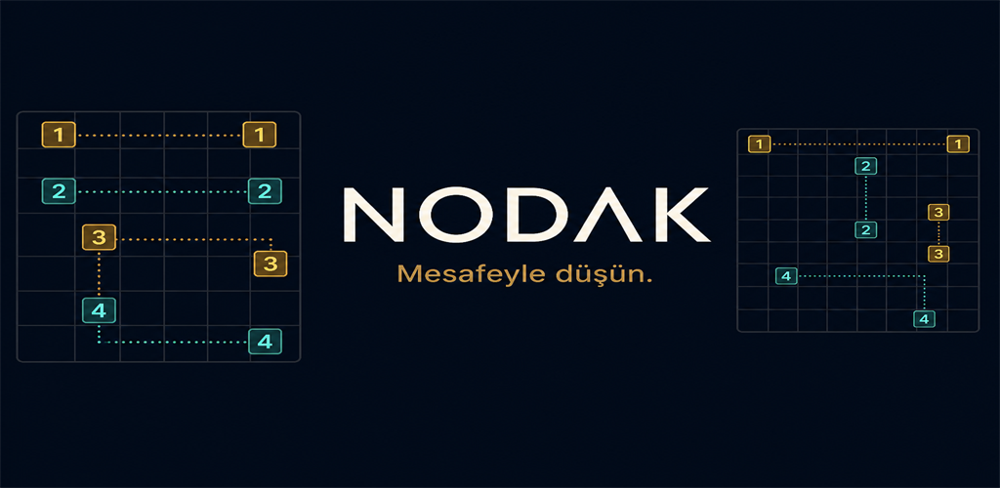

# Nodak

Mobile number-logic puzzle game built with Expo and React Native.

Android closed testing is live on Google Play (`com.nodak.puzzle`). The public store link will be added here when production is approved.

<p align="center">
  
</p>

Nodak is a mobile puzzle game: fill a grid using distance clues between matching digits.

## Game idea

Fill a 6×6 or 8×8 board with digits `1` to `4`. Each digit must sit exactly that many empty cells away from its matching digit in the same row or column.

## Highlights

- Two board formats: `6×6` and `8×8`
- Progressive level structure with increasing challenge
- First-launch how-to-play guide
- Helps, themes, language, and sound settings
- Rate the app from Settings (Play Store)
- Rewarded hints via Google Mobile Ads
- `300+` levels currently available

## Screenshots

<p align="center">
  
  
  
  
</p>

## Feature graphic

<p align="center">
  
</p>

Play Console listing copy and checklist: [`play-store/`](./play-store/).

## Setup

```bash
npm install
npm start
```

```bash
npm run core:smoke
npm run levels:generate
```

## Stack

Expo · React Native · TypeScript · React Navigation · Reanimated · Google Mobile Ads

## License

MIT
