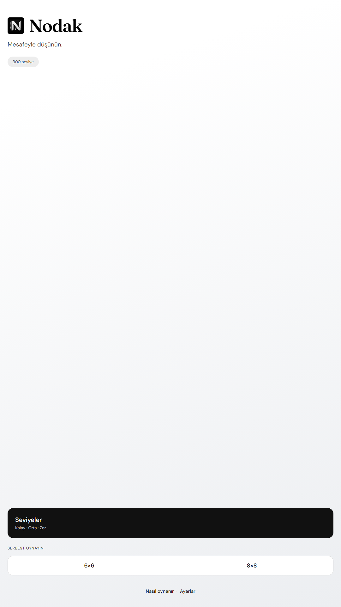
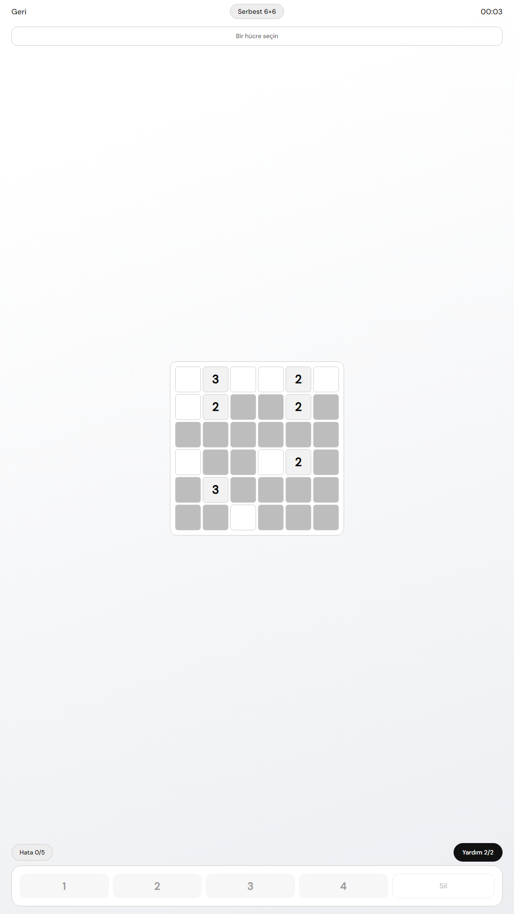
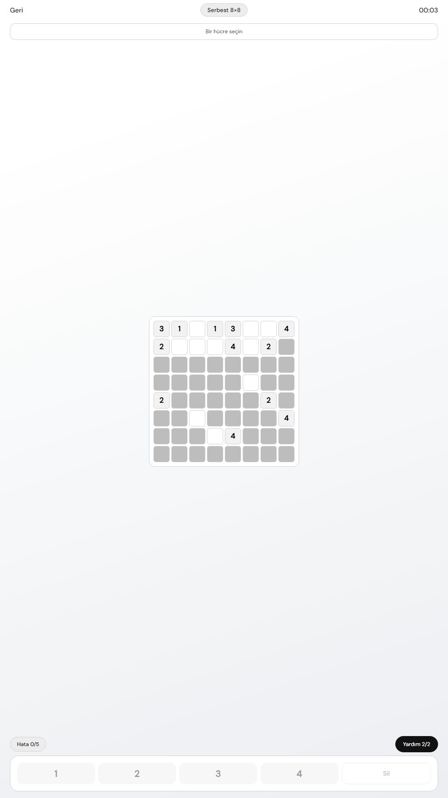
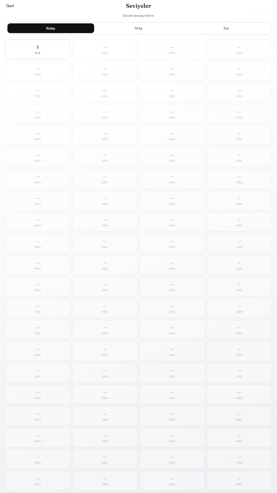

# Nodak

Mobile number-logic puzzle game built with Expo and React Native.

Status: in development

## Screenshots

<div align="center">
  
  
  
  
</div>

## Rules

Fill a 6×6 or 8×8 board with digits 1–4. Each digit must sit exactly that many empty cells away from its twin in the same row or column.

## Features

- Multiple puzzle sizes (6×6 and 8×8 boards)
- Progressive difficulty levels
- Smooth animations with Reanimated
- Time tracking for each puzzle
- 300+ levels
- Responsive design for all mobile devices

## Setup

```bash
npm install
npm start
```

```bash
npm run core:smoke
npm run levels:generate
```

## Stack

Expo · React Native · TypeScript · React Navigation · Reanimated

## License

MIT
